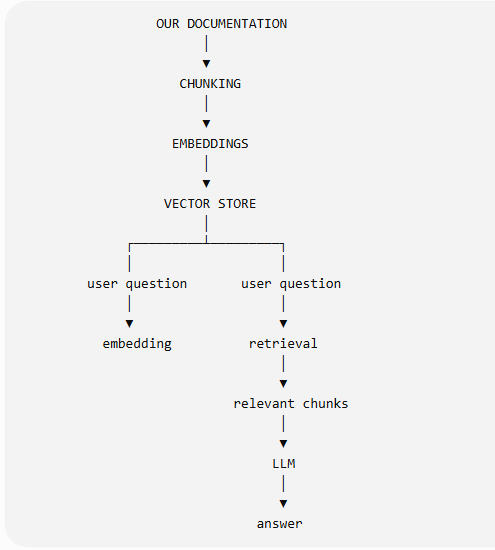

# RAG Technical Taster
>A hands-on exploration of Retrieval-Augmented Generation (RAG), developed to understand and document the technologies and implementation patterns behind RAG systems.

Current status
> 🚧: Work in progress
> Currently implements an in-memory vector database and explores the foundational components of a RAG pipeline. Additional components will be added as development progresses.

Topics currently covered:

- Embeddings
- Vector representations
- Vector similarity/search
- In-memory vector database
- Retrieval
- RAG architecture

Purpose

> This project serves as both a technical learning exercise and a documentation project. The goal is to develop a practical understanding of RAG implementation while producing clear, developer-oriented technical documentation

# Retrieval-Augmented Generation
 
A hands-on exploration of RAG pipelines using Java.

## What is RAG?

RAG (Retrieval-Augmented Generation) combines information retrieval with an LLM: it retrieves relevant content from a knowledge source and provides it to the model as context for generating an answer.

In short: retrieve relevant information first, then generate an answer grounded in that information.

## What This Project Does

This project builds a small RAG pipeline from the ground up. It
loads Markdown documentation, chunks the content, generates
embeddings, retrieves relevant chunks, and eventually uses an LLM
to generate an answer from the retrieved content.

## The RAG Pipeline

1. Load documents
2. Chunk documents
3. Generate embeddings
4. Store embeddings
5. Retrieve relevant chunks
6. Generate an answer

## Project Goals

- Understand the components of a RAG pipeline
- Explore how document structure affects retrieval
- Learn how embeddings enable semantic search
- Implement the pipeline in Java

## Documentation

- [RAG Concepts](project-docs/rag-concepts.md)--if you are interested in RAG background information
- [Java Implementation Walkthrough](project-docs/java-walkthrough.md)--if you want to see how to develop code to implement RAG
- [Documentation Considertions](project-docs/documentation-considerations.md)--if you want to see how to write technical documentation for optimized RAG consumption
