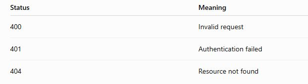

# Documentation Considerations

## Don't make the reader infer information that the text could state explicitly.

Humans are surprisingly good at resolving things like:

"These are enforced automatically."

An embedding/retrieval system has a much easier job with:

"API rate limits are enforced automatically."

This is one reason clear technical writing is increasingly valuable in AI systems.

## Headings become particularly important

Consider:

```
## Authentication

API keys are required.
```
versus:

```
## Authentication Methods for the REST API

The REST API requires an API key for authentication.

```


The second gives the retrieval system more semantic information.

But here's the wrinkle:

You don't want to keyword-stuff documentation for an embedding model.

Don't write:

`API authentication REST API authentication API key authentication`

That's terrible technical writing and doesn't magically become good because an embedding model is watching.

Instead, write naturally and explicitly.

## Tables are another interesting case

Suppose you have:

<p>

</p>

A human can understand that instantly.

A RAG pipeline can handle tables, but depending on how your document parser/chunker processes Markdown, you can end up with awkward chunks.

For example, the retrieval system might encounter:
```
400 | Invalid request
401 | Authentication failed
404 | Resource not found
```

That's still reasonably useful.

But a poorly extracted table can become much less useful.

For important information, prose can sometimes be more robust:

"The API returns HTTP 401 when authentication fails. It returns HTTP 404 when the requested resource cannot be found."

Again, this isn't about writing for the machine. It's about making the information explicit.

## Lists have a similar issue

This:
```
## Authentication Requirements

- API key
- HTTPS
- Authorization header
- Valid account
```
is perfectly readable.

But this:
```
## Authentication Requirements

Requests to the REST API must use HTTPS and include a valid API
key in the Authorization header. The API key must belong to an
active account.
```
contains stronger semantic relationships.

For RAG, I'd generally favor the second form for important conceptual information, while still using lists when lists genuinely improve human usability.